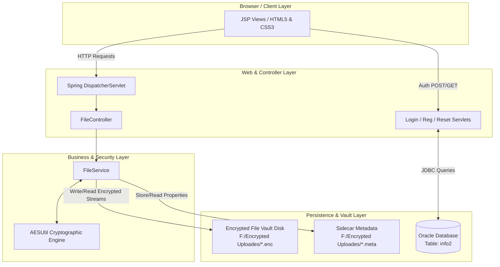

# Secure File Sharing System

<div align="center">


**A full-stack, enterprise-grade web application built with Spring MVC and Jakarta Servlets that delivers high-performance file uploading, on-the-fly AES-128 encryption, GZIP compression, and secure streaming downloads.**

</div>

---

## 📖 Project Overview

**Secure File Sharing System** (also known within the interface as **SecureShare**) is a next-generation file vault and sharing platform. It is engineered to protect sensitive digital assets by ensuring that files are never stored in plaintext on disk. 

Every file uploaded through the platform is intercepted, compressed via **GZIP** (`Deflater.BEST_COMPRESSION`), and symmetrically encrypted using **AES-128** (`CipherOutputStream`) before being persisted to the storage vault (`F:/Encrypted Uploades`). During download or retrieval, files are streamed and decrypted on the fly directly into the HTTP response buffer (`CipherInputStream`), maintaining zero footprint of unencrypted files on the server filesystem while delivering maximum speed and bandwidth efficiency.

In addition to cryptographic vault management, the system features a complete **User Authentication & Authorization engine** backed by an **Oracle Database**, allowing users to securely register, log in, manage their stored files, and reset credentials.

---

## ✨ Key Features

- 🔐 **Military-Grade AES Encryption (`AESUtil`)**:
  - Implements `AES` transformation using Java Cryptography Extension (JCE) (`SecretKeySpec` and `Cipher`).
  - Automatic `.enc` suffix wrapping and secure byte-level cipher stream transformation.
- 📦 **Integrated On-the-Fly Compression (`GZIPOutputStream`)**:
  - Files are compressed with maximum level compression (`Deflater.BEST_COMPRESSION`) concurrently during the encryption pass, significantly reducing disk storage requirements.
  - Automatically detects GZIP magic headers (`0x1f8b`) using a pushback stream during decryption (`PushbackInputStream`) for seamless decompression.
- 🗂️ **Sidecar Metadata Storage (`.meta` Files)**:
  - Generates dedicated `.meta` properties files alongside every `.enc` file to accurately track original file sizes versus encrypted/compressed sizes.
  - Automatically calculates real-time storage reduction percentages for user dashboard visualization.
- 🛡️ **Directory Traversal Protection**:
  - Every file read, write, and delete request is strictly validated (`filePath.normalize().startsWith(uploadDir)`) to eliminate relative path traversal vulnerabilities (`../`).
- 👥 **Robust User Account Management**:
  - Full registration (`/reg`), secure login (`/login`), and password recovery (`/reset_password`) endpoints integrated with Oracle JDBC.
- 🎨 **Modern, Responsive UI & Glassmorphic Aesthetics**:
  - Crafted with custom CSS (`external.css`), dynamic cards, and FontAwesome 6 icons, providing a sleek, intuitive, and visually stunning dashboard experience.

---

## 🏗️ System Architecture & Workflow



### 📤 File Upload & Encryption Pipeline
1. **Multipart Request**: The client submits a file via the `/uploadFile` form endpoint.
2. **Spring Multipart Handling**: `StandardServletMultipartResolver` (configured in `spring-servlet.xml` & `web.xml`) accepts requests up to **10 MB** (file size limit **5 MB**).
3. **Stream Transformation**: `FileService.saveEncrypted(MultipartFile)` opens an input stream from the uploaded file and pipes it into `AESUtil.encrypt()`.
4. **Compression + Cipher Pass**: Data passes through `CipherOutputStream` wrapped with `ConfigurableGZIPOutputStream`, outputting directly to `<original_name>.enc` inside `F:/Encrypted Uploades`.
5. **Metadata Creation**: A sidecar `<original_name>.enc.meta` file is saved containing `originalSize` and `encryptedSize`.

### 📥 File Download & Decryption Pipeline
1. **Download Request**: The user initiates a download via `/download?name=<stored_name>`.
2. **Security Check**: `FileService.streamDecrypted()` normalizes the requested filename and ensures the target resolves within the designated vault boundary.
3. **Response Header Setup**: The controller strips the `.enc` extension, setting the `Content-Disposition` header to prompt an attachment download with the original filename.
4. **On-the-Fly Stream Decryption**: `AESUtil.decrypt()` reads the `.enc` file via `CipherInputStream` and `GZIPInputStream`, streaming plaintext bytes directly to `HttpServletResponse.getOutputStream()`.

---

## 🛠️ Technology Stack

| Component | Technology | Version / Details |
| :--- | :--- | :--- |
| **Backend Framework** | Spring MVC | `6.0.0-SNAPSHOT` (`spring-webmvc`, `spring-context`, `spring-core`) |
| **Servlet Container API** | Jakarta Servlets & JSP | Jakarta EE 9+ (`web-app_5_0.xsd`, Servlet 5.0 / JSP API) |
| **Database** | Oracle Database | Oracle JDBC Driver (`ojdbc11.jar`) |
| **Cryptography** | Java Cryptography Extension (JCE) | AES-128 (`SecretKeySpec`), `Cipher`, `CipherInputStream/OutputStream` |
| **Compression** | Java Zip / Deflater | `GZIPOutputStream` (`Deflater.BEST_COMPRESSION`) & `GZIPInputStream` |
| **Frontend Technologies** | JSP, JSTL, HTML5, CSS3 | Custom Glassmorphic CSS (`external.css`), FontAwesome 6.4.0 |
| **File Upload Resolver** | Spring Multipart | `StandardServletMultipartResolver` |

---

## 🗄️ Database Schema (`Oracle DB`)

The application connects to an Oracle Database instance (`jdbc:oracle:thin:@localhost:1521:xe`) and maintains user profiles within the `info2` table.

### Table Definition (`info2`)
```sql
CREATE TABLE info2 (
    id VARCHAR2(50) PRIMARY KEY,
    fname VARCHAR2(100) NOT NULL,
    lname VARCHAR2(100) NOT NULL,
    uname VARCHAR2(100) NOT NULL UNIQUE,
    pword VARCHAR2(100) NOT NULL,
    email VARCHAR2(150) NOT NULL
);
```

### JDBC Connection Parameters
- **Driver**: `oracle.jdbc.driver.OracleDriver`
- **Connection URL**: `jdbc:oracle:thin:@localhost:1521:xe`
- **Default User**: `scott`
- **Default Password**: `tiger`

---

## 📂 Project Directory Structure

```text
SpringMVCFileUploadingAndDownloadingWithListUsingIndexWithAES/
├── src/
│   └── main/
│       ├── java/
│       │   └── com/national/computer/
│       │       ├── controller/
│       │       │   └── FileController.java        # Spring MVC Route Controller (`/`, `/files`, `/upload`, etc.)
│       │       ├── dto/
│       │       │   └── FileInfo.java              # DTO handling file names, timestamps, sizes & reduction %
│       │       ├── model/                         # Domain classes & models
│       │       ├── service/
│       │       │   └── FileService.java           # Vault storage, metadata management, deletion & streaming
│       │       ├── servlets/
│       │       │   ├── LoginServlet.java          # Handles `/login` authentication via Oracle JDBC
│       │       │   ├── RegistrationServlet.java   # Handles `/reg` user account creation
│       │       │   └── ResetPasswordServlet.java  # Handles `/reset_password` account recovery
│       │       └── util/
│       │           └── AESUtil.java               # Core cryptographic engine (AES + GZIP compression streams)
│       └── webapp/
│           ├── WEB-INF/
│           │   ├── lib/                           # Spring 6, Micrometer, AspectJ & Oracle JDBC (`ojdbc11.jar`)
│           │   ├── views/
│           │   │   ├── index.jsp                  # Landing & intro page
│           │   │   ├── login.jsp                  # Login interface
│           │   │   ├── registration.jsp           # Account registration portal
│           │   │   ├── forgot.jsp                 # Password reset request form
│           │   │   ├── upload.jsp                 # File upload dashboard
│           │   │   ├── list.jsp                   # Encrypted vault file repository & manager
│           │   │   ├── result.jsp                 # Operation status confirmation view
│           │   │   └── logout.jsp                 # Session termination summary
│           │   ├── spring-servlet.xml             # Spring component scan, view resolver & multipart configuration
│           │   └── web.xml                        # Servlet mappings, welcome files & multipart limits
│           └── resources/
│               └── css/
│                   └── external.css               # Main design system & responsive UI styles
├── build/                                         # Compiled bytecode & web artifacts
├── .classpath                                     # Eclipse project classpath definition
├── .project                                       # Eclipse WTP dynamic web project configuration
└── README.md                                      # Project documentation
```

---

## 🌐 Application Endpoints & Routes

| HTTP Method | Route URL | Controller / Servlet | Description |
| :---: | :--- | :--- | :--- |
| `GET` | `/` | `FileController.Home()` | Renders the welcome home/landing page (`index.jsp`). |
| `GET` | `/login1` | `FileController.loginPage()` | Displays the user login portal (`login.jsp`). |
| `POST` | `/login` | `LoginServlet.service()` | Validates credentials against Oracle DB (`info2` table). |
| `GET` | `/registration` | `FileController.registrationPage()` | Displays the user registration portal (`registration.jsp`). |
| `GET` | `/reg` | `RegistrationServlet.doGet()` | Registers a new account into the database (`info2` table). |
| `GET` | `/forgot` | `FileController.forgotPage()` | Displays the password recovery form (`forgot.jsp`). |
| `POST` | `/reset_password` | `ResetPasswordServlet.service()` | Updates user password upon matching username and email. |
| `GET` | `/upload` | `FileController.uploadPage()` | Renders the file upload interface (`upload.jsp`). |
| `POST` | `/uploadFile` | `FileController.uploadFile()` | Accepts `MultipartFile`, encrypts/compresses, and saves to vault. |
| `GET` | `/files` | `FileController.listFiles()` | Scans `F:/Encrypted Uploades`, parses metadata, and lists vault contents. |
| `GET` | `/download` | `FileController.downloadFile()` | Streams `name` parameter file, decrypting on the fly into the browser. |
| `POST` | `/delete` | `FileController.deleteFile()` | Securely deletes `.enc` file and its sidecar `.meta` property file. |
| `GET` | `/logout1` | `FileController.logout()` | Invalidates active user session and redirects to logout summary. |

---

## 🚀 Installation & Setup Instructions

### 1. Prerequisites
- **Java Development Kit (JDK)**: JDK 17 or higher (Required for Spring Framework 6.x & Jakarta EE 9+).
- **Web/Application Server**: Apache Tomcat 10.x+ (Must support Jakarta Servlet 5.0 specifications).
- **Database**: Oracle Database (11g Express Edition, 18c, or 21c).
- **IDE**: Eclipse IDE for Enterprise Java and Web Developers (or IntelliJ IDEA Ultimate).

### 2. Database Configuration
1. Start your Oracle Database instance (`localhost:1521:xe`).
2. Log in using `scott` / `tiger` (or update credentials in `LoginServlet.java`, `RegistrationServlet.java`, and `ResetPasswordServlet.java`).
3. Run the SQL table creation script:
   ```sql
   CREATE TABLE info2 (
       id VARCHAR2(50) PRIMARY KEY,
       fname VARCHAR2(100),
       lname VARCHAR2(100),
       uname VARCHAR2(100) UNIQUE,
       pword VARCHAR2(100),
       email VARCHAR2(100)
   );
   ```

### 3. Vault Directory Setup
By default, the application uses two directory locations for multipart staging and permanent encrypted storage on the `F:` drive:
- **Multipart Staging**: `F:/uploads` (Configured in `web.xml`)
- **Encrypted Vault Storage**: `F:/Encrypted Uploades` (Configured in `FileService.java`)

Ensure both directories exist or ensure your application has write permissions to create them:
```bash
mkdir -p "F:/uploads"
mkdir -p "F:/Encrypted Uploades"
```
*(Note: If running on Linux/macOS or a different drive letter, update the path in `web.xml` (`<location>`) and `FileService.java` (`uploadDir` path creation).*

### 4. Deploying in Eclipse IDE
1. Open Eclipse and navigate to **File -> Import -> Existing Projects into Workspace**.
2. Select the root directory (`SpringMVCFileUploadingAndDownloadingWithListUsingIndexWithAES`).
3. Ensure **Apache Tomcat v10.0+** runtime is configured in **Project Preferences -> Targeted Runtimes**.
4. Right-click the project -> **Run As -> Run on Server**.
5. Access the application in your browser at:
   ```text
   http://localhost:8080/SpringMVC9FileUploadingAndDownloading/
   ```

---

## 🔒 Security Specifications & Cryptographic Deep Dive

### AES Cryptographic Parameters (`AESUtil.java`)
- **Cipher Transformation**: `AES` (Electronic Codebook / Cipher Block Chaining depending on JCE defaults).
- **Secret Key**: `16-byte` (`128-bit`) symmetric key (`MySuperSecretKey`).
- **Buffer Size**: Optimized `8,192-byte` (8 KB) chunked stream buffers to ensure high memory efficiency even under concurrent large file uploads.

### Security Defenses Implemented
1. **Zero-Plaintext Storage Policy**: Unencrypted file data never touches non-volatile disk storage. Encryption happens immediately in the input-to-output pipeline.
2. **Path Traversal Mitigation**:
   ```java
   Path targetLocation = uploadDir.resolve(storedFileName).normalize();
   if (!targetLocation.startsWith(uploadDir)) {
       throw new SecurityException("Invalid file path");
   }
   ```
   Ensures bad actors cannot supply filenames like `../../Windows/System32/config` to overwrite or leak system files.
3. **Session Management**: Explicit session invalidation (`session.invalidate()`) during logout prevents session fixation and hijacking.

---

## 👨‍💻 Author & Attribution

**Original Work and Development by Pratham**
- **Note**: *This project is a personal engineering showcase and original work demonstrating advanced Spring MVC integration, byte-stream encryption, compression pipelines, and Jakarta EE servlet architecture.*
- **Connect / Follow**: [@pratham_17498](https://www.instagram.com/pratham_17498/)

---

<div align="center">
  <p><b>Secure File Sharing System &copy; 2026</b> — Built with Java, Spring MVC, and Oracle Database.</p>
</div>
